# Components

## HomePage
  #### ToolBar

  The ToolBar has 3 buttons on user's upper left corner. 
  
 <h5>Homepage</h5>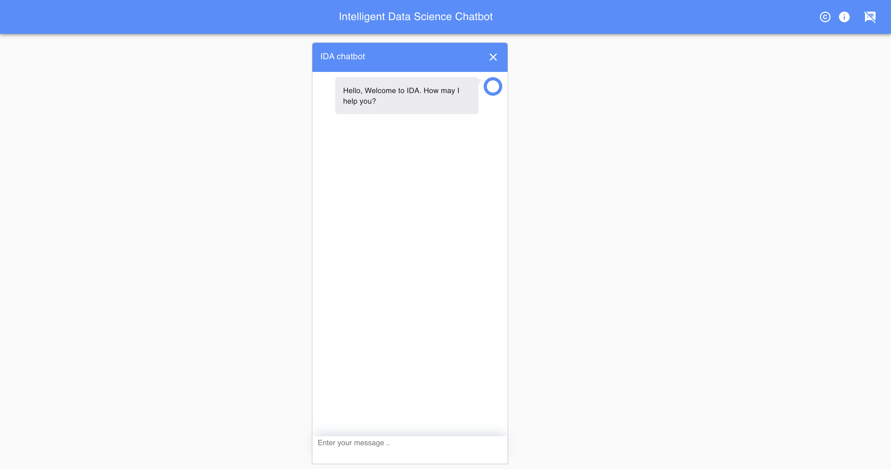

  *Starting from right.*

  ***ChatBot handler icon***: This icon helps user to expand and collapse the chatbot.

  ***Information icon***: It helps user to know more information about the project.

  ***Command icon*** : This helps user see the latest command the user has requested on the chatbot.

  #### ChatBot

 
  The Chatbot is user's virtual assistant. Like any other chatbot, IDA-Chatbot also helps one understand the usage of the application.

  ***Dataset***: User can give commands to *`list all the datasets`*. user can also *`upload dataset`* and / or *`load`* a already existing dataset.
  
<h5>List all datasets</h5>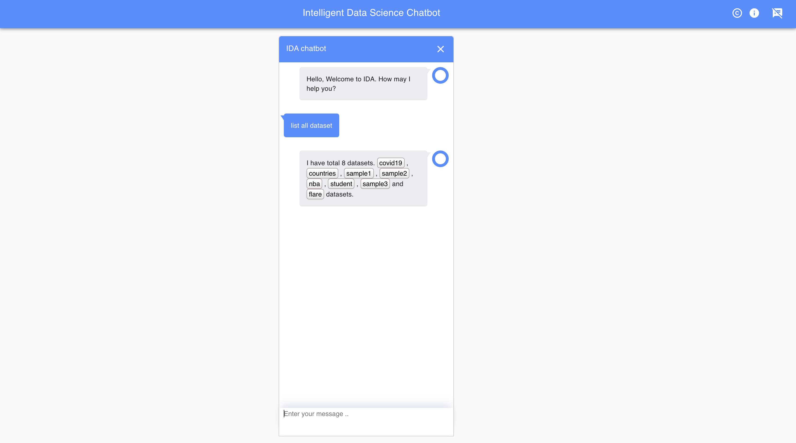

 
  Once the dataset is loaded we can see a data loaded view with which user can request for their desired visualisation.

  ***Visualisation***:  Loaded view has a collapsable tree view towards the users left. 
  Using the treeview user can select a .csv file that will represent the data with the help of datatable.
  User can draw different visualisation for the selected file by giving command *`draw visualisation_name`*. For example: *`draw barchart`*
  The Chatbot itself will guide the user with suggestions or hint to customise the visualisation according their perspective.

*Apart from these commands there are some feature of chatbot that can help user to make the best use of the application.*

When hovered on the message timestamp is displayed.

Use of arrow keys in case of repititive usage of command. Such as a command has to be given twice the user can type once and simply press the upper arrow key to use the same command which saves time.

Chatbot can also accept few  html styling commands.

The user upper-right corner of chatbot has a close button which helps with chatbot collapsing.

## Upload dataset
  Command:*`upload `* or *`upload dataset`*.

  When this command is given it opens a upload dataset wizard. It has 3 steps. 

  1. Initially it asks the user to upload multiple *`.csv`* files only. There is option to delete the file incase it is no longer needed.
  If decided to go further there are two buttons one is to upload and other is cancel upload  at the bottom-right corner of the user. To continue upload click upload.
  
<h5>Upload wizard</h5>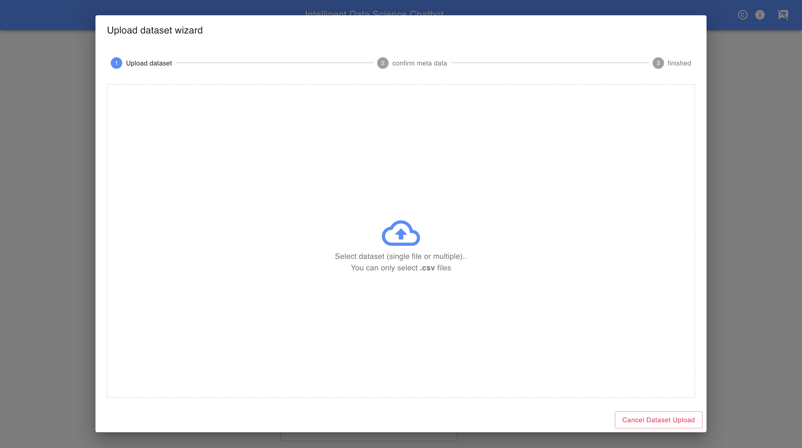

  2. Then, the application creates and stores a metadata file for each uploaded file to do so user should give some information. like *`Dataset name:''`* field cannot be empty and it has to Alphanumeric. For example : *`Dataset name:'IDA1'`. If IDA1 already exists in the database an alert is triggered which says *Dataset name already exists* . The user can optionally further the column names, column descriptions and its datatype. For example if there exist a column name: *Date* ,column descriptions : *Date the incident took place.* and datatype : *Date* . It can changed to whatever the user prefers, just to consider, column name: *Incident Date* , column description : *Date of the incident.* and datatype : *String*. 
  If decided to go further there are three buttons one is to back to go back to the first step , Save MetaData to save the changes for metadata and then is cancel dataset upload at the bottom-right corner of the user. To continue upload click Save MetaData.
  
<h5>Confirm Meta Data</h5>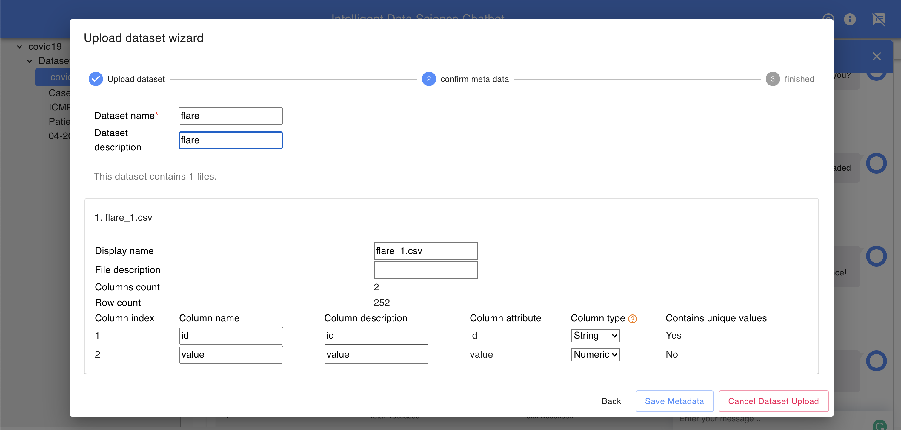

 3. Finally, after processing the changes made by the user. A message will be displayed *Your dataset was uploaded successfully.You can start using it now*.
 
<h5>Process Finished</h5>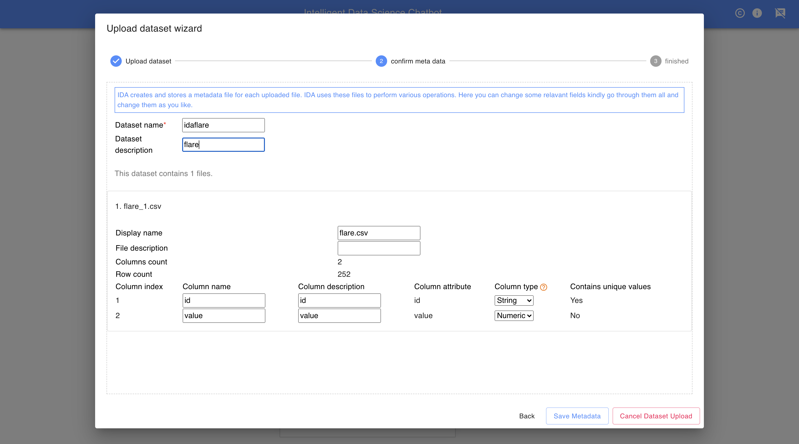

## Load dataset

  Command: *`load`* or *`load dataset_name`*. For example: *`load countries`* .
  
<h5>Load dataset</h5>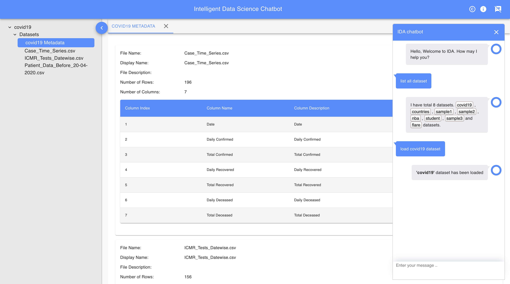

  One way of load the dataset to is to simple give *`load`*  as a command. When given the chatbot asks them for the dataset name. 
  and the other way is to give command more precisely  with the dataset name *`load dataset_name`*.
  Either of these commands helps the user to load a already existing dataset in the application.

## Loaded view
  
<h5>After loading a dataset</h5>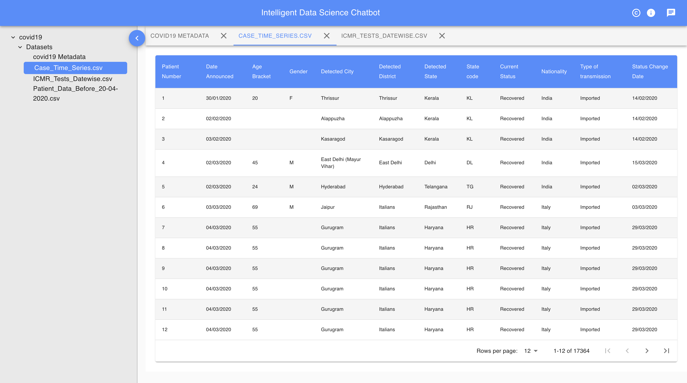

  As soon as the dataset has been loaded the view changes with much various additional properties.
  On the left hand of the user a collapsable Treeview will be loaded that helps the to select a partical file and view the data with the help of datatable.
  Multiple files can be clicked one after the other and then can navigate with help of tabs.

  
<h5>Collapsable Treeview</h5>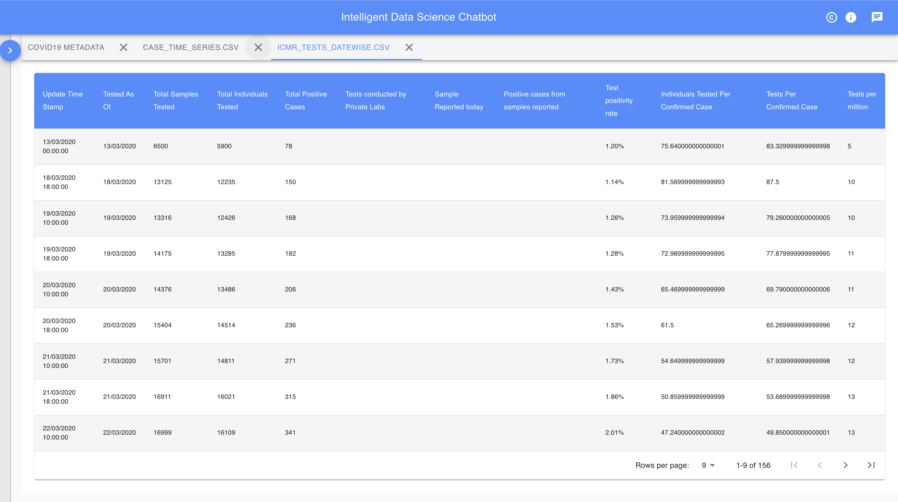

## Visualisation
Command:*`load visualisation_name`* or *`draw visualisation_name`*. For example:*`load barchart`*. or *`draw barchart`*.\
Visualisation Options : *Barchart,Bubble chart, Linechart, ScatterPlot, Scatter Matrix.*\
When using either *Barchart* or *BubbleChart*  the chatbot would trigger a question *Do you want to group it?* if answered yes, it will group multiple bars/bubbles based on a column given for grouping. It then loads a *Grouped barchat/Grouped Bubblechart*.

<h5>Barchart</h5>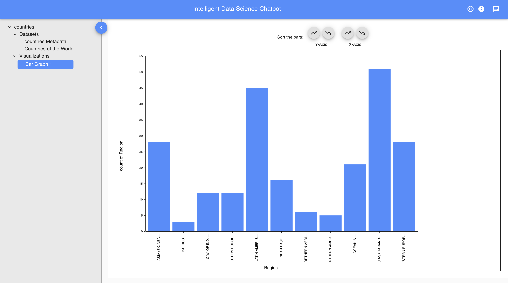

<h5>Y-Axis sorted barchart</h5> 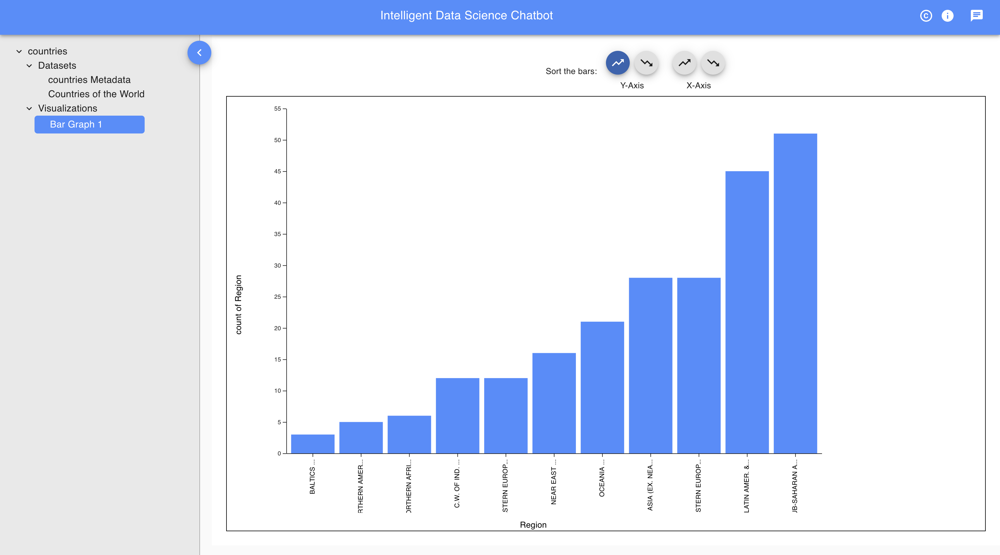

  #### Suggestions 
  The application as a suggestion module which makes it really easy for the user to understand what command to be given in order to get a precise result.
  The column/row selections and co-ordinate values differs from each one visualisation to other. To make it easy the suggestion module suggests the user what can be given to draw the visualisation.
  For example to load a barchart the user might want to select fewer items.
  When a command *`load linechart`* is given the chatbot asks the user how many items would the one want to select and then suggest with a example as to what values the bot is expecting  for the considered example it suggest *`Eg: all, first 20, last 30, or from 55 to 100 records`* for the items to be selected.
  Now, the co-ordinate values, if the value types are exceptional then the suggestion module tells what type of value to be given.
  For example in line chart the X-Axis accepts Temporal data only. The suggestion module suggests something like *`Which column values should be mapped to X-Axis (Temporal data)?`*
  
<h5>Line chart Suggestion</h5> 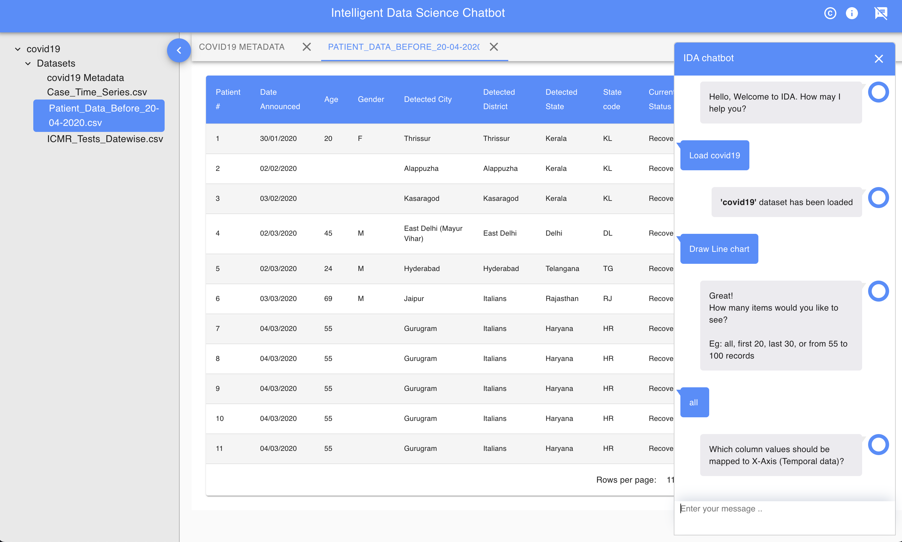

  #### Clustering
  1. K-MEANS CLUSTERING ALGORITHMS : In data mining, k-means clustering is a method of cluster analysis which aims to partition n observations into k clusters in which each observation belongs to the cluster with the nearest mean. This results into a partitioning of the data space into Verona cells.

  
<h5>K-Means Clustering chatbot commands</h5> 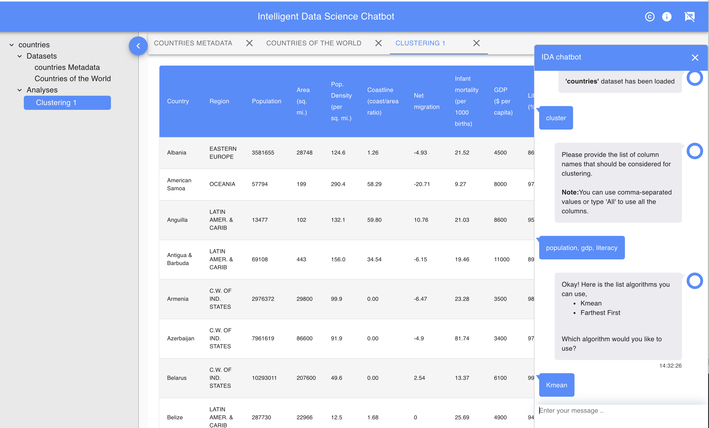

  
<h5>K-Means Clustered data </h5> 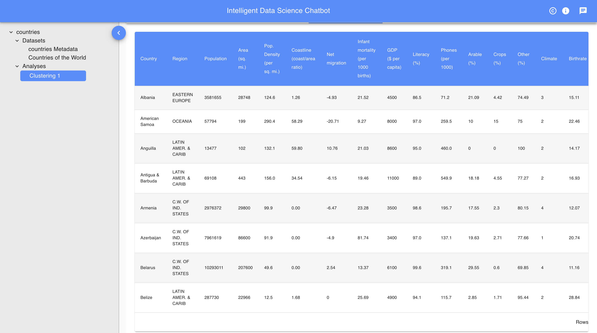

  2. FARTHEST FIRST ALGORITHM: This algorithm is a Variant of K means that places each cluster centre in turn at the point furthest from the existing cluster centers. 
  This point must lie within the data area. This greatly sped up the clustering in most cases since less reassignment and adjustment is needed.

  
<h5>Farthest First Clustering chatbot commands</h5> 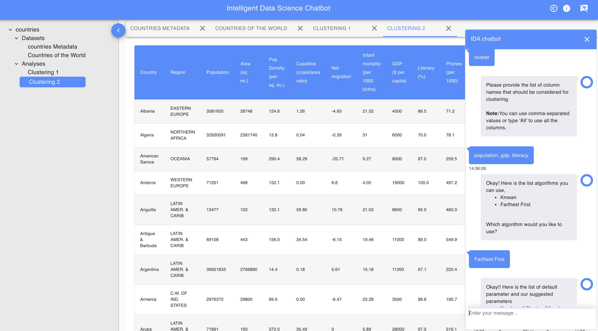

  
<h5>Farthest First Clustered data</h5> 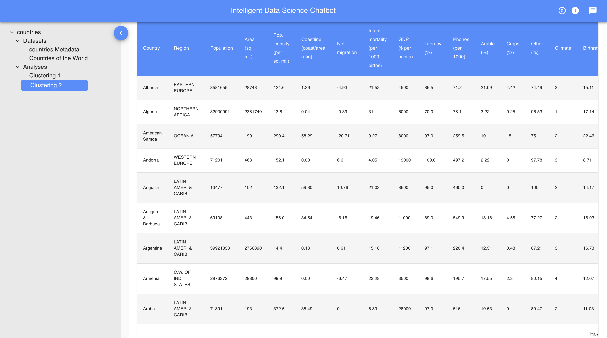
