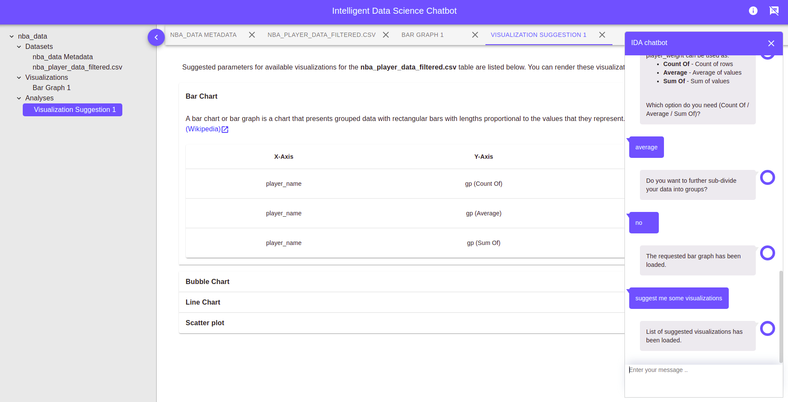

# IDA Workflow

## Intro and Upload a dataset

As soon as the application is loaded, IDA displays a brief intro message about itself and lists out all the datasets available for you to analyse or render visualizations.

You can inform the chatbot if they would like to upload a new dataset using the chat-box. A new window is opened for uploading files for the new dataset.

Once all the files are selected, you can click the _`upload`_ button to generate the metadata of the uploaded files as shown below.

You can verify if the data types of the columns have been assigned correctly, and are allowed to change it using the dropdown next to each column. You can enter the descriptions for each column as well. Once the metadata is ready for all the files, you can click _`Save Metadata`_ button to save the dataset onto the IDA server. 

The uploaded dataset is then automatically loaded onto the application, for you to analyse it and render visualizations.

## Rendering a visualization

Once the dataset is loaded onto the screen, you can use the data from the tables of the dataset to render visualizations. As a first step, you need to select a table for which you need the visualization. This can be done by clicking on the table name under the dataset hierarchy on the navigation bar on the left of your screen.

### Rendering a bar chart
As an example, below steps can be followed to draw a simple bar chart for a table. As first step, you need to ask the chatbot to render a bar chart by typing _`I want to render a bar chart`_. This will initiate the bar chart rendering process and the chat bot will continue with asking you the information that it needs to draw a bar chart as shown in the below pictures.

Once the chatbot gets all the information required to render a visualizations, it adds the visualization onto the users' view in a new tab as shown below.

## Visualization suggestions from IDA

You can ask the chatbot for suggesting visualizations along with the values for their parameters for a selected table. To do this, you need to have a table as the active tab in your view. You can use the chat window to ask IDA to give the suggestions, for example  _`Suggest me some visualizations`_. The list of suggestions are then added onto the view in a separate tab with the option of rendering them using a button click.

## Clustering

Clustering is the process of dividing the rows of a table into groups or clusters. You can use either _`Kmean`_ or _`Farthest First`_ algorithm to perform clustering on a selected table. As usual, you need to have the table in the active tab to do this. Below are the pictures showing step by step process or messages exchanged between user and chatbot for clustering.

Once the clustering algorithm is choosen, IDA displays the list of suggested parameters for clustering. You can change the values of any parameters if needed. You can say no to continue with the default/suggested parameters.

Once the clustering is done, the clustered table is displayed in a new tab. It shows the table along with a new column `Cluster` having the cluster id of each row starting from 0, 1, 2 ... N-1 where N is the number of clusters choosen in the list of parameters above. 

After clustering, you can use the button in the response message from the chatbot to render the scatterplot matrix to visualize the clusters.

